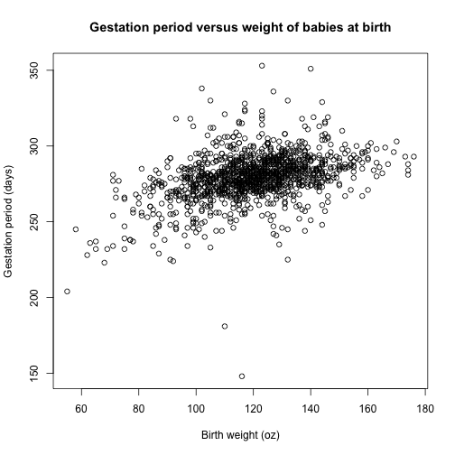

Guessing Some Metrics about Babies!
========================================================
author: Pauline Worters
date: September 2015


Introduction
========================================================
We shall describe an Shiny application written for the Developing Data Products course by Johns Hopkins University.

The goal of this application/game is to estimate the means of the gestation period and weight at birth of babies.

If the guessed means are close enough to the true means, then a "SUCCESS" text will appear.


Babies Data
========================================================

The fields of the "Babies" data are shown here:

```
 [1] "id"        "pluralty"  "outcome"   "date"      "gestation"
 [6] "sex"       "wt"        "parity"    "race"      "age"      
[11] "ed"        "ht"        "wt1"       "drace"     "dage"     
[16] "ded"       "dht"       "dwt"       "marital"   "inc"      
[21] "smoke"     "time"      "number"   
```
For this application, we will only use the fields "gestation" and "wt".
More details of this dataset can be found at http://people.uncw.edu/frierson/S215%5Cbabies_lab.pdf


Babies Application
========================================================
The application is hosted at https://pworters.shinyapps.io/DevelopingDataProject.

A plot is available at the app (and shown here) to help you:
 


Summary
========================================================
- A Shiny application (game) is hosted at https://pworters.shinyapps.io/DevelopingDataProject
- The application requests for your inputs to the mean gestation period and weight of babies
- When you have succeeded at a close guess, a "SUCCESS" is returned
- Have fun!!
